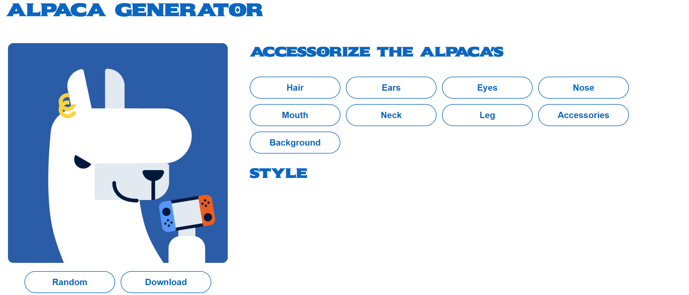

# 🦙 Alpaca Generator

A simple web app that lets you customize an alpaca and download the result as an image.

---

## ✨ Features

- Customize alpaca (hair, eyes, ears, etc.)
- Random alpaca generator
- Download alpaca as image

---
## 📸 Screenshot

## 🛠️ Built With

- HTML
- CSS
- JavaScript
- html2canvas

---

## 📁 Project Structure
alpaca/ 
│── index.html 
│── alpaca.css 
│── alpaca.js 
│── alpaca/ (images folder) 

---

## 🚀 How to Run

1. Download or clone the project
2. Open `index.html` in your browser

---

## 🚀 Live Demo
👉 (https://wilidiriba20.github.io/alpaca/)

